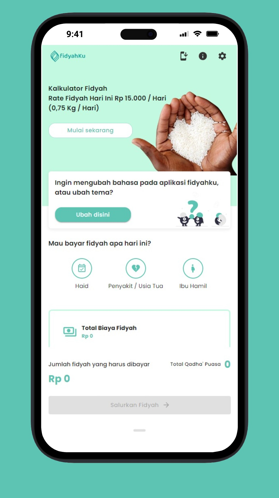
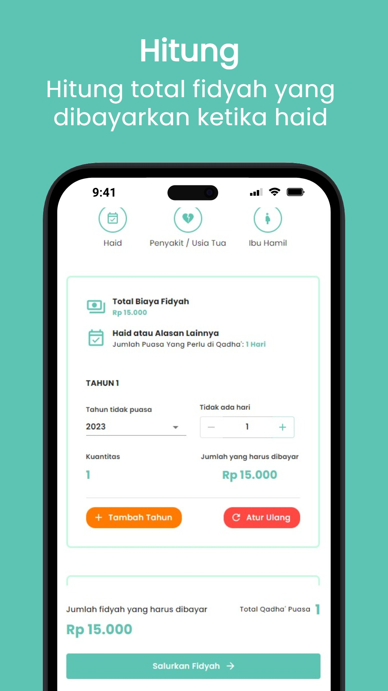
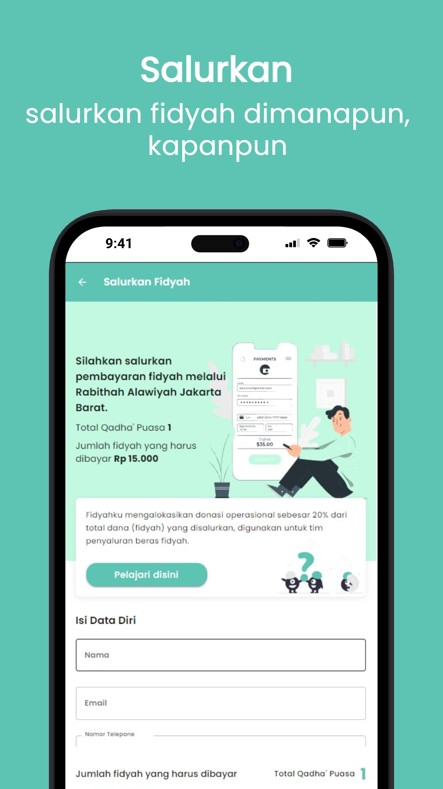

# Fidyahku UI

>

 
 

> Aplikasi untuk membantu kamu menghitung bayaran fidyah berdasarkan haid / sakit / orang yang sudah tua. Tambahkan tahun, jumlah haid / sakit dan lihat jumlah yang harus dibayar.

## API

https://github.com/nouvalkaff/fidyahCalculator

## Author

👤 **Usamah Basalamah (Frontend Developer)**

- Github: [usamahbass](https://github.com/usamahbass)

👤 **Muhammad Nouval Alkaf (Backend Developer)**

- Github: [nouvalkaff](https://github.com/nouvalkaff)

## Show your support

Give a ⭐️ if this project helped you!

---
